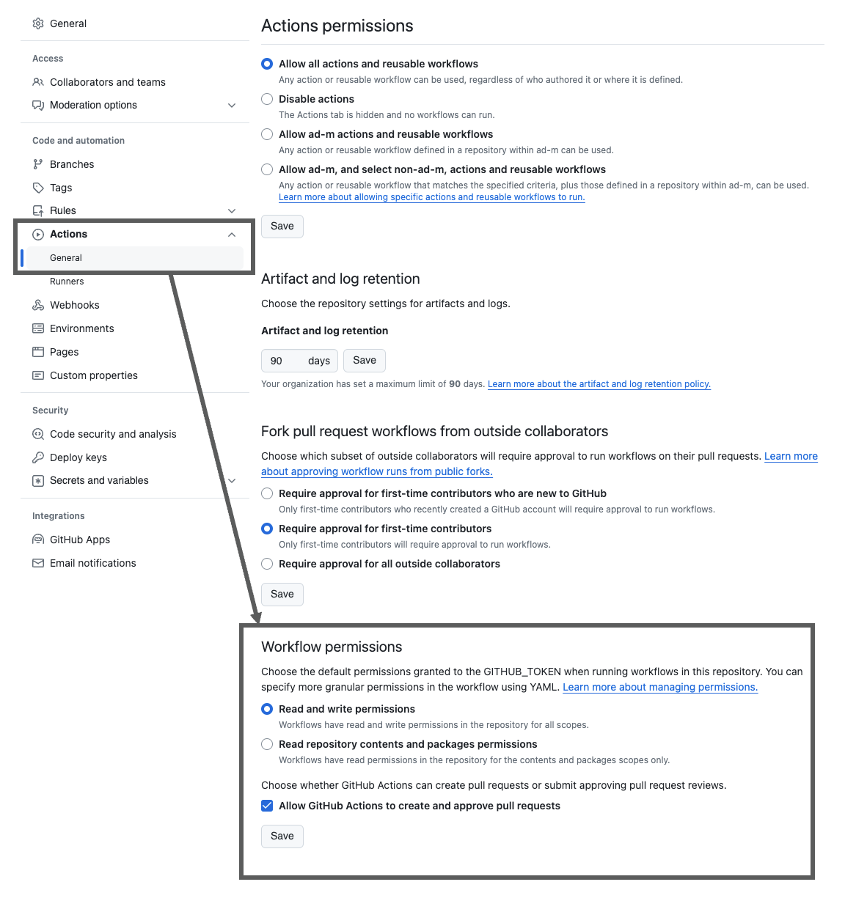

# GitHub Action for GitHub Push

The GitHub Actions for pushing local changes to GitHub using an authorized GitHub token.

## Use Cases

- update new code placed in your repository, e.g. by running a linter on it,
- track changes in script results using Git as an archive,
- publish page using GitHub-Pages,
- mirror changes to a separate repository.

## Requirements and Prerequisites

To ensure your GitHub Actions workflows function correctly, it's important to configure the `GITHUB_TOKEN` with the appropriate access rights for each repository. 

Follow these steps to set up the necessary permissions:
1. Navigate to your repository on GitHub.
2. Click on `Settings` located in the repository toolbar.
3. In the left sidebar, click on `Actions`.
4. Under the `Actions` settings, find and click on `General`.
5. Scroll down to the `Workflow permissions` section.
6. You will see the default permission setting for the `GITHUB_TOKEN`. Click on the `Read and write permissions` option.
7. With this setting, your workflow will be able to read the repository's contents and push back changes, which is required for using this GitHub Action.

Make sure to save your changes before exiting the settings page.

> [!NOTE]
> 
> Granting `Read and write permissions` allows workflows to modify your repository, including adding or updating files and code. Always ensure that you trust the workflows you enable with these permissions.



The `GITHUB_TOKEN` permissions can also be configured globally for all jobs in a workflow or individually for each job.

This example demonstrates how to set the necessary permissions for the `contents` and `pull-requests` scopes on a job level:

```yaml
jobs:
  job1:
    runs-on: ubuntu-latest
    permissions:                # Job-level permissions configuration starts here
      contents: write           # 'write' access to repository contents
      pull-requests: write      # 'write' access to pull requests
    steps:
      - uses: actions/checkout@v4
```

To apply permissions globally, which will affect all jobs within the workflow, you would define the `permissions` key at the root level of the workflow file, like so:

```yaml
permissions:                    # Global permissions configuration starts here
  contents: read                # 'read' access to repository contents
  pull-requests: write          # 'write' access to pull requests
jobs:
  job1:
    runs-on: ubuntu-latest
    steps:
      - uses: actions/checkout@v4
```

Adjust the permission levels and scopes according to your workflow's requirements. For further details on each permission level, consult the [GitHub documentation](https://docs.github.com/en/actions/security-guides/automatic-token-authentication#permissions-for-the-github_token).


## Usage

### Example Workflow file

An example workflow to authenticate with GitHub Platform and to push the changes to a specified reference, e.g. an already available branch:

```yaml
jobs:
  build:
    runs-on: ubuntu-latest
    steps:
    - uses: actions/checkout@v4
      with:
        persist-credentials: false # otherwise, the token used is the GITHUB_TOKEN, instead of your personal access token.
        fetch-depth: 0 # otherwise, there would be errors pushing refs to the destination repository.
    - name: Create local changes
      run: |
        ...
    - name: Commit files
      run: |
        git config --local user.email "41898282+github-actions[bot]@users.noreply.github.com"
        git config --local user.name "github-actions[bot]"
        git commit -a -m "Add changes"
    - name: Push changes
      uses: ad-m/github-push-action@master
      with:
        github_token: ${{ secrets.GITHUB_TOKEN }}
        branch: ${{ github.ref }}
```

An example workflow to use the branch parameter to push the changes to a specified branch e.g. a Pull Request branch:

```yaml
name: Example
on: [pull_request, pull_request_target]

jobs:
  build:
    runs-on: ubuntu-latest
    steps:
    - uses: actions/checkout@v4
      with:
        ref: ${{ github.head_ref }}
        fetch-depth: 0
    - name: Commit files
      run: |
        git config --local user.email "github-actions[bot]@users.noreply.github.com"
        git config --local user.name "github-actions[bot]"
        git commit -a -m "Add changes"
    - name: Push changes
      uses: ad-m/github-push-action@master
      with:
        branch: ${{ github.head_ref }}
```

An example workflow to use the force-with-lease parameter to force push to a repository:

```yaml
jobs:
  build:
    runs-on: ubuntu-latest
    steps:
    - uses: actions/checkout@v4
      with:
        ref: ${{ github.head_ref }}
        fetch-depth: 0
    - name: Commit files
      run: |
        git config --local user.email "github-actions[bot]@users.noreply.github.com"
        git config --local user.name "github-actions[bot]"
        git commit -a -m "Add changes"
    - name: Push changes
      uses: ad-m/github-push-action@master
      with:
        force_with_lease: true
```

An example workflow to use a GitHub App Token together with the default token inside the checkout action. You can find more information on the topic [here](https://github.com/ad-m/github-push-action/issues/173):

```yaml
jobs:
  build:
    runs-on: ubuntu-latest
    steps:
    - uses: actions/checkout@v4
      with:
        ref: ${{ github.head_ref }}
        fetch-depth: 0
        persist-credentials: false
    - name: Generate Githup App Token
      id: generate_token
      uses: tibdex/github-app-token@v1
      with:
        app_id: ${{ secrets.APP_ID }}
        installation_id: ${{ secrets.INSTALLATION_ID }}
        private_key:  ${{ secrets.APP_PRIVATE_KEY }}
    - name: Commit files
      run: |
        git config --local user.email "test@test.com"
        git config --local user.name "Test"
        git commit -a -m "Add changes"
    - name: Push changes
      uses: ad-m/github-push-action@master
      with:
        github_token: ${{ env.TOKEN }}
```

An example workflow to use the non default token push to another repository. Be aware that the force-with-lease flag is in such a case not possible:

```yaml
jobs:
  build:
    runs-on: ubuntu-latest
    steps:
    - uses: actions/checkout@v4
      with:
        ref: ${{ github.head_ref }}
        fetch-depth: 0
        token: ${{ secrets.PAT_TOKEN }}
    - name: Commit files
      run: |
        git config --local user.email "test@test.com"
        git config --local user.name "Test"
        git commit -a -m "Add changes"
    - name: Push changes
      uses: ad-m/github-push-action@master
      with:
        github_token: ${{ secrets.PAT_TOKEN }}
        repository: Test/test
        force: true
```

An example workflow to update/ overwrite an existing tag:

```yaml
jobs:
  build:
    runs-on: ubuntu-latest
    steps:
    - uses: actions/checkout@v4
      with:
        ref: ${{ github.head_ref }}
        fetch-depth: 0
    - name: Commit files
      run: |
        git config --local user.email "github-actions[bot]@users.noreply.github.com"
        git config --local user.name "github-actions[bot]"
        git tag -d $GITHUB_REF_NAME
        git tag $GITHUB_REF_NAME
        git commit -a -m "Add changes"
    - name: Push changes
      uses: ad-m/github-push-action@master
      with:
        force: true
        tags: true
```

An example workflow to authenticate with GitHub Platform via Deploy Keys or in general SSH:

```yaml
jobs:
  build:
    runs-on: ubuntu-latest
    steps:
    - uses: actions/checkout@v4
      with:
        ssh-key: ${{ secrets.SSH_PRIVATE_KEY }}
        persist-credentials: true
    - name: Create local changes
      run: |
        ...
    - name: Commit files
      run: |
        git config --local user.email "41898282+github-actions[bot]@users.noreply.github.com"
        git config --local user.name "github-actions[bot]"
        git commit -a -m "Add changes"
    - name: Push changes
      uses: ad-m/github-push-action@master
      with:
        ssh: true
        branch: ${{ github.ref }}
```

An example workflow to push to a protected branch inside your repository. Be aware that it is necessary to use a personal access token and use it inside the `actions/checkout` action. It may be a good idea to specify the force-with-lease flag in case of sync and push errors. If you want to generate an adequate personal access token, you can [follow](docs/personal-acces-token.md#creation-of-a-personal-access-token) these instructions:

```yaml
jobs:
  build:
    runs-on: ubuntu-latest
    steps:
      - uses: actions/checkout@v4
        with:
          ref: ${{ github.head_ref }}
          fetch-depth: 0
          token: ${{ secrets.PAT_TOKEN }}
      - name: Commit files
        run: |
          git config --local user.email "test@test.com"
          git config --local user.name "Test"
          git commit -a -m "Add changes"
      - name: Push changes
        uses: ad-m/github-push-action@master
        with:
          github_token: ${{ secrets.PAT_TOKEN }}
          repository: Test/test
          force_with_lease: true
```

### Inputs

| name               | value   | default               | description                                                                                                                                                                                                                                                                                                          |
|--------------------|---------|-----------------------|----------------------------------------------------------------------------------------------------------------------------------------------------------------------------------------------------------------------------------------------------------------------------------------------------------------------|
| github_token       | string  | `${{ github.token }}` | [GITHUB_TOKEN](https://docs.github.com/en/actions/security-guides/automatic-token-authentication#using-the-github_token-in-a-workflow) <br /> or a repo scoped <br /> [Personal Access Token](https://docs.github.com/en/authentication/keeping-your-account-and-data-secure/creating-a-personal-access-token).      |
| ssh                | boolean | false                 | Determines if ssh/ Deploy Keys is used.                                                                                                                                                                                                                                                                              |
| branch             | string  | (default)             | Destination branch to push changes. <br /> Can be passed in using `${{ github.ref }}`.                                                                                                                                                                                                                               |
| force              | boolean | false                 | Determines if force push is used.                                                                                                                                                                                                                                                                                    |
| force_with_lease   | boolean | false                 | Determines if force-with-lease push is used. Please specify the corresponding branch inside `ref` section of the checkout action e.g. `ref: ${{ github.head_ref }}`. Be aware, if you want to update the branch and the corresponding tag please use the `force` parameter instead of the `force_with_lease` option. |
| atomic             | boolean | true                  | Determines if [atomic](https://git-scm.com/docs/git-push#Documentation/git-push.txt---no-atomic) push is used.                                                                                                                                                                                                       |
| push_to_submodules | string  | 'on-demand'           | Determines if --recurse-submodules=<strategy> is used. The value defines the used strategy.                                                                                                                                                                                                                          |
| push_only_tags     | boolean | false                 | Determines if the action should only push the tags, default false                                                                                                                                                                                                                                                    |
| tags               | boolean | false                 | Determines if `--tags` is used.                                                                                                                                                                                                                                                                                      |
| directory          | string  | '.'                   | Directory to change to before pushing.                                                                                                                                                                                                                                                                               |
| repository         | string  | ''                    | Repository name. <br /> Default or empty repository name represents <br /> current github repository. <br /> If you want to push to other repository, <br /> you should make a [personal access token](https://github.com/settings/tokens) <br /> and use it as the `github_token` input.                            |

## Troubleshooting

If you see the following error inside the output of the job, and you want to update an existing Tag:
```log
To https://github.com/Test/test_repository
 ! [rejected]        0.0.9 -> 0.0.9 (stale info)
error: failed to push some refs to 'https://github.com/Test/test_repository'
```

Please use the `force` instead the `force_with_lease` parameter. The update of the tag is with the `--force-with-lease` parameter not possible.

## License

The Dockerfile and associated scripts and documentation in this project are released under the [MIT License](LICENSE).

## No affiliation with GitHub Inc.

GitHub are registered trademarks of GitHub, Inc. GitHub name used in this project are for identification purposes only. The project is not associated in any way with GitHub Inc. and is not an official solution of GitHub Inc. It was made available in order to facilitate the use of the site GitHub.
