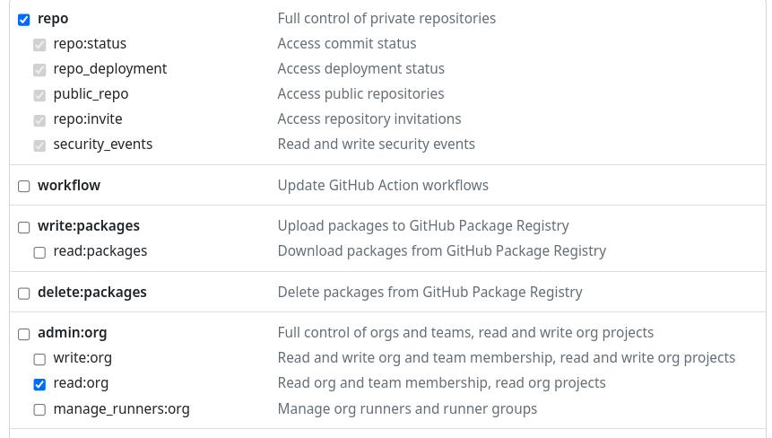
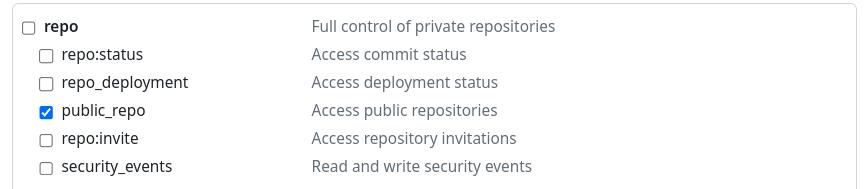
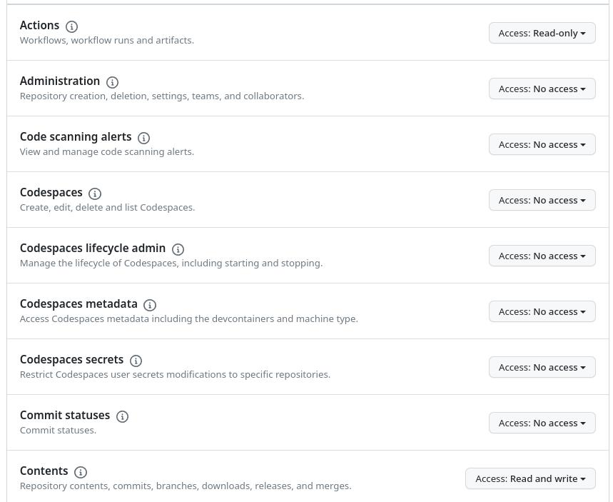

# Creation of a personal access token

1. Login to your GitHub account and navigate to the following [page](https://github.com/settings/tokens).
2. Click on the generate new token button and start the process to get a new token (classic or fine-gained)
   - In the classic mode your token needs as a minimum requirement for private repositories, complete repo and admin read:org access. 
   
   - In the classic mode and you want to use it on public repositories, your token needs public_repo access. 
   
   - If you want to use a fine-gained token as minimum requirement, your token needs access to the repository, contents read/write, metadata read and actions read access. 
3. Be aware, if you want to update GitHub workflow files, it's necessary that your token got workflow rights (read/write on fine-gained tokens).